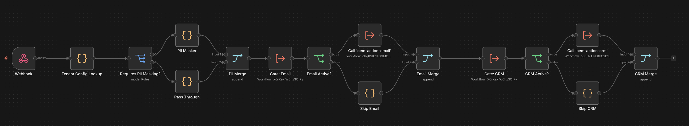
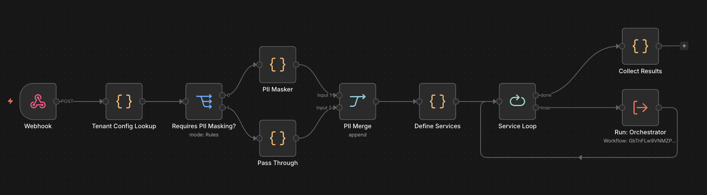
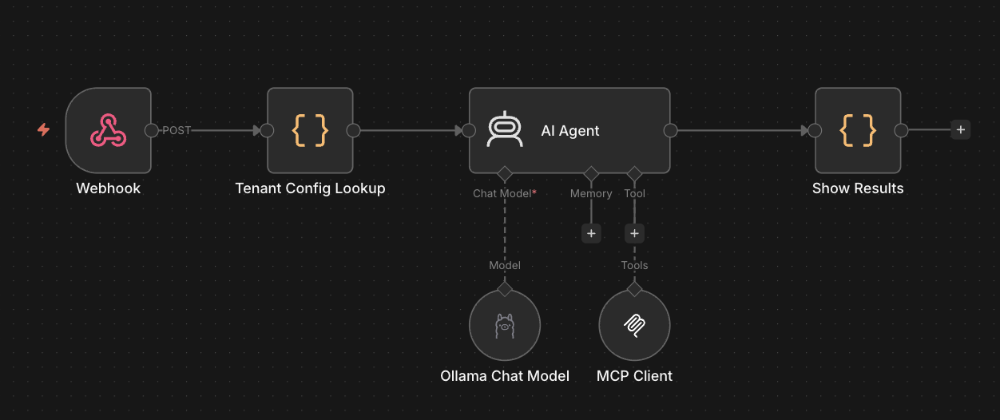

## n8n OEM Multi-Tenant Event Router

An architecture example showing how an OEM platform can use n8n to deliver 
configurable automation services to multiple tenants from a single workflow instance.

> **Note:** This is a demonstration of architectural patterns, not a 
> production-ready implementation. Authentication, error handling, retry 
> logic, and monitoring are outside the scope of this showcase.

## The Problem

OEM partners embedding n8n in their products face a common challenge: serving 
many customers with different systems, compliance requirements, and business logic 
— without building and maintaining a separate workflow per customer.

## Architecture

Webhook → Tenant Config Lookup → Service Orchestration

All three implementations share the same entry point and tenant config 
lookup. The difference is in how service orchestration is handled.

## v1 — Linear Service Chain

Each service is wired as a dedicated gate-and-execute block in the main 
workflow. Simple to understand and debug. Does not scale — every new service 
adds nodes directly to the main workflow.

→ [v1 details](workflows/v1/)

## v2 — Loop-Based Orchestration

Services are defined as an array. A loop iterates over them and delegates 
execution to a central orchestrator sub-workflow. Adding a new service 
requires no structural changes to the main workflow.

→ [v2 details](workflows/v2/)

## v3 — AI Agent Dispatch via MCP

An AI agent replaces the loop and orchestrator. It reads the tenant config, 
determines which services to call, and invokes them as MCP tools in the 
correct order — including chaining PII masking before downstream services.

→ [v3 details](workflows/v3/)

## Author

Javier Carazo — [linkedin.com/in/javiercarazo](https://linkedin.com/in/javiercarazo)